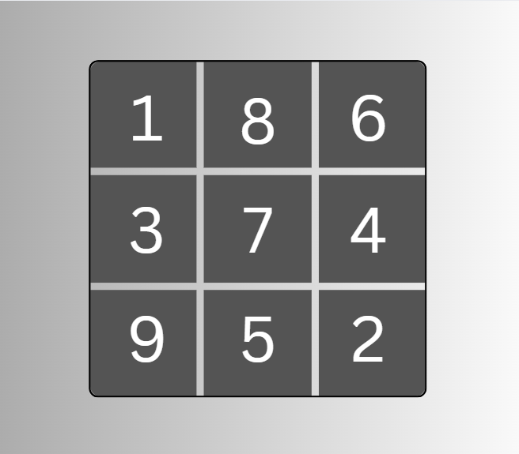

# About the Project
The website takes as input an incomplete/unsolved sudoku board and utilizes a recursive backtracking algorithm (implemented in Python) to return the solved sudoku board, which is then rendered onto the webpage (using Flask framework and Jinja).

## Website Link

## Demo

## Recognition:

### Submitted to Coolest Projects 2025 (Advanced Programming)

#### Feedback: 
